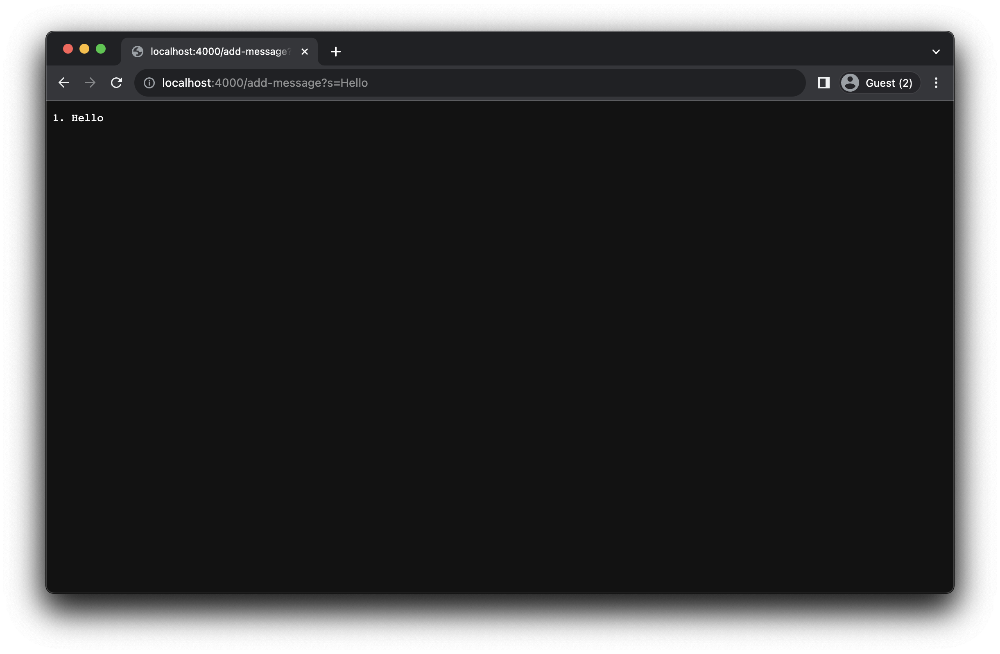
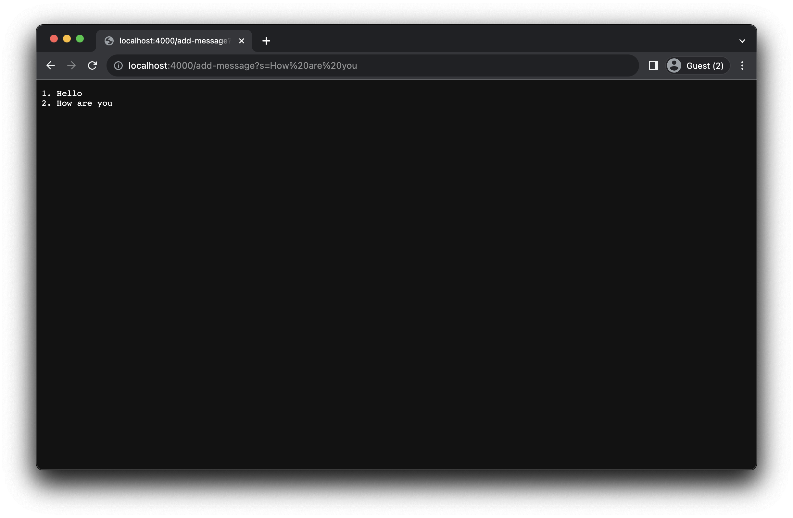
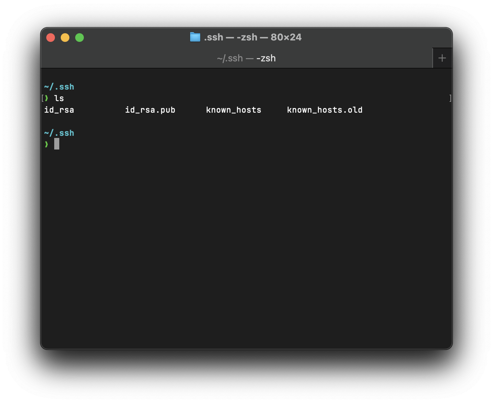
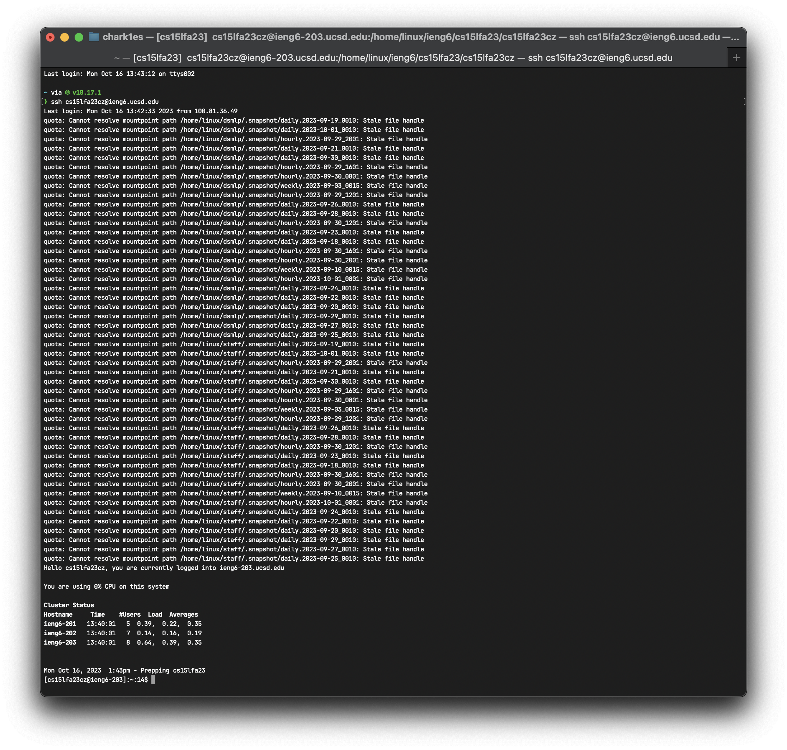

# Lab 2 Report - Charles Nguyen

## Part 1

### StringServer Code:

```java
import java.io.IOException;
import java.net.URI;
import java.util.ArrayList;

class Handler implements URLHandler {
    // The one bit of state on the server: a number that will be manipulated by
    // various requests.
    int num = 0;
    ArrayList<String> messages = new ArrayList<String>();

    public String handleRequest(URI url) {
        if (url.getPath().equals("/")) {
            String combinedMessages = "";
            for (int i = 0; i < messages.size(); i++) {
                combinedMessages += i+1 + ". " + messages.get(i) + "\n";
            }
            return combinedMessages;
        } else {
            if (url.getPath().contains("/add-message")) {
                String[] parameters = url.getQuery().split("=");
                if (parameters[0].equals("s")) {
                    messages.add(parameters[1]);
                    String combinedMessages = "";
                    for (int i = 0; i < messages.size(); i++) {
                        combinedMessages += i+1 + ". " + messages.get(i) + "\n";
                    }
                    return combinedMessages;
                        }
            }
            return "404 Not Found!";
        }
    }
}

class StringServer {
    public static void main(String[] args) throws IOException {
        if(args.length == 0){
            System.out.println("Missing port number! Try any number between 1024 to 49151");
            return;
        }

        int port = Integer.parseInt(args[0]);

        Server.start(port, new Handler());
    }
}
```

### Screenshots:

#### Adding the word "Hello":



-   The method in my code was called "handleRequest"
-   The argument is a URL. We get the path of the url "/add-message" and parse the queries associated with the url "s=Hello". We then take the substring of everything after the equal sign and then add it to the ArrayList.
-   In regards to redirecting the user and running the function, no values would change. However, if we're talking about the variables in the backend of the server, then the Arraylist in the server would change as it is used to store the strings.

#### Adding the question "How are you"



-   The method in my code was called "handleRequest"
-   The argument is a URL. We get the path of the url "/add-message" and parse the queries associated with the url "s=How are you". We then take the substring of everything after the equal sign and then add it to the ArrayList.
-   In regards to redirecting the user and running the function, no values would change. However, if we're talking about the variables in the backend of the server, then the Arraylist in the server would change as it is used to store the strings.

## Part 2

### Screenshots:

> Note: The private key and the public key are in the same directory

#### Private Key



#### Public Key


#### Logging in without password



## Part 3

Something that I learned from lab in Week 2/3 that I have not learned before was storing public / private keys to allow you to login without a password.
