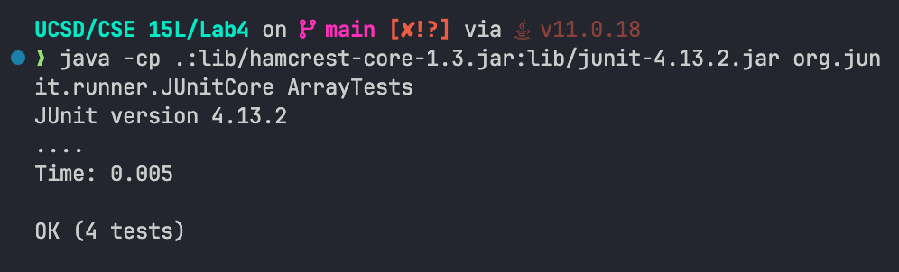

# Lab Report 3 - Charles Nguyen

## Part 1

### Failure-inducing input

```java

@Test
  public void testNull() {
    int[] input1 = null;
    assertThrows(NullPointerException.class, () -> {
      ArrayExamples.reversed(input1);
    });
  }

```

### Code that does not contain a failure:

```java

 @Test
  public void testReversedNumbers() {
    int[] input1 = {3, 4, 5};
    assertArrayEquals(new int[]{ 5, 4, 3 }, ArrayExamples.reversed(input1));
  }

```

### Symptom:


\\

### Bugged Code:

```java

public class ArrayExamples {

  static int[] reversed(int[] arr) {
    int[] newArray = new int[arr.length];
    for(int i = 0; i < arr.length; i += 1) {
      arr[i] = newArray[arr.length - i - 1];
    }
    return arr;
  }

}

```

### Fixed Code:

```java


public class ArrayExamples {


  static int[] reversed(int[] arr) {
    int[] newArray = new int[arr.length];
    for(int i = 0; i < arr.length; i += 1) {
      newArray[arr.length - i - 1] = arr[i];
    }
    return newArray;
  }

}


```

#### Explanation:

The bug in the code was that it did not properly reverse the contents in the list. The reason for that was because when it loops through the list `arr`, it would override the array with an empty item from the `newArray` (since it was created with empty items with the same length as `arr`). My fix makes it to where it stores the item in the `newArray` in reverse order, by going backwards in the list.

## Part 2

The command I chose was the `find` command.

### -delete

What this argument does is that it finds the directories / files and deletes whichever matches the statement. This command is useful because it can delete folders / subfolders in bulk without needing to manually select anything.

#### File

```bash
find test.py -delete
```

No additional feedback was given

#### Directory

```bash
find test -delete
```

No additional feedback was given

### -empty

This arguments checks to see if there are any empty folders / files. This command can be useful, especially when paired up with the `-delete` argument to help clear up folders / files.

#### File

When a file is empty:

```bash
find test.py -empty

test.py
```

When a file is not empty:

```bash
find test.py -empty
```

#### Directory

When a directory is empty:

```bash
find test -empty

test
```

When a directory is not empty:

```bash
find test -empty
```

### -iname

This argument is similar to the `-name` argument but it is case-insensitive. This command is useful to find general files or folders without needing to worry about how it is spelled out.

#### File

```bash
ind . -iname "*.py"

./test.py
```

#### Directory

```bash
find . -iname Test

./test
```

### -regex

This command finds and matches any regex expressions that is provided. This command is useful when looking for specific file / folders names or file extensions

#### File

```bash

find . -regex ".*\.\(py\)"

./test.py

```

#### Directory

```bash

find . -regex '\./test'

./test
```
