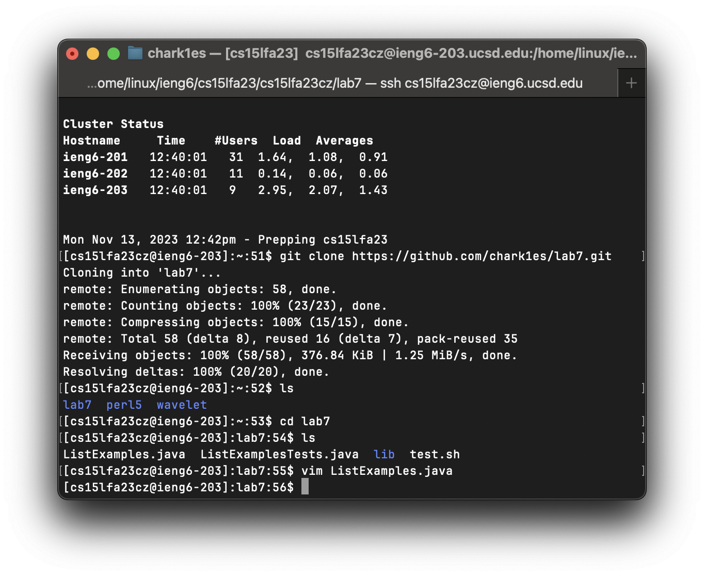

# Lab Report 4 - Charles Nguyen

## Commands:

### Logging into ieng6:

```
ssh cse15lfa23cz@ieng6.ucsd.edu
```

### Cloning my forked Lab7 github repo:

```
git clone https://github.com/chark1es/lab7.git
```



### Running bash test.sh:

```bash
[cs15lfa23cz@ieng6-202]:lab7:71$ bash test.sh
JUnit version 4.13.2
..E
Time: 0.54
There was 1 failure:
1) testMerge2(ListExamplesTests)
org.junit.runners.model.TestTimedOutException: test timed out after 500 milliseconds
        at ListExamples.merge(ListExamples.java:44)
        at ListExamplesTests.testMerge2(ListExamplesTests.java:19)

FAILURES!!!
Tests run: 2,  Failures: 1
```

### Using Vim to edit the file:

```

cd lab7
vim ListExamples.java

```


### Within Vim

I used these commands to get onto the line with the error

```bash
<G>
<UP>
<UP>
<UP>
<UP>
<UP>
<UP>
```

I used these commands to get to the typo labeled `index1`

```bash
<Right Arrow>
<Right Arrow>
<Right Arrow>
<Right Arrow>
<Right Arrow>
<Right Arrow>
<Right Arrow>
<Right Arrow>
<Right Arrow>
<Right Arrow>
<Right Arrow>
```

I used these commands to replace the `1` in `index1` to `2`.

```
<r>
<2>
```


I used these commands to save the file

```
<ESC>
<:wq>
```

### Test Passed


### Adding, commiting, and pushing to github

Due to the length of the terminal, the results were copied and pasted into the following codeblock:

```
[cs15lfa23cz@ieng6-202]:lab7:78$ git add ListExamples.java
[cs15lfa23cz@ieng6-202]:lab7:79$ git commit ListExamples.java
[main 6117c34] fixed
 Committer: Charles M Nguyen <cs15lfa23cz@ieng6-202.ucsd.edu>
Your name and email address were configured automatically based
on your username and hostname. Please check that they are accurate.
You can suppress this message by setting them explicitly. Run the
following command and follow the instructions in your editor to edit
your configuration file:

    git config --global --edit

After doing this, you may fix the identity used for this commit with:

    git commit --amend --reset-author

 1 file changed, 1 insertion(+), 1 deletion(-)
[cs15lfa23cz@ieng6-202]:lab7:80$ git push
Username for 'https://github.com': chark1es
Password for 'https://chark1es@github.com':
remote: Support for password authentication was removed on August 13, 2021.
remote: Please see https://docs.github.com/en/get-started/getting-started-with-git/about-remote-repositories#cloning-with-https-urls for information on currently recommended modes of authentication.
fatal: Authentication failed for 'https://github.com/chark1es/lab7.git/'
[cs15lfa23cz@ieng6-202]:lab7:81$ git push
Username for 'https://github.com': cmn010@ucsd.edu
Password for 'https://cmn010@ucsd.edu@github.com':
remote: Support for password authentication was removed on August 13, 2021.
remote: Please see https://docs.github.com/en/get-started/getting-started-with-git/about-remote-repositories#cloning-with-https-urls for information on currently recommended modes of authentication.
fatal: Authentication failed for 'https://github.com/chark1es/lab7.git/'
```

#### Commands:

I used `git add ListExamples.java` since that is the file I changed. I did `git commit` to commit the file. I did the following steps:

```
<shift> <r>
<fixing code>
<:wq>
```

I than ran the command
`git push`. I had to authenicate my credentials for it to be able to push.
